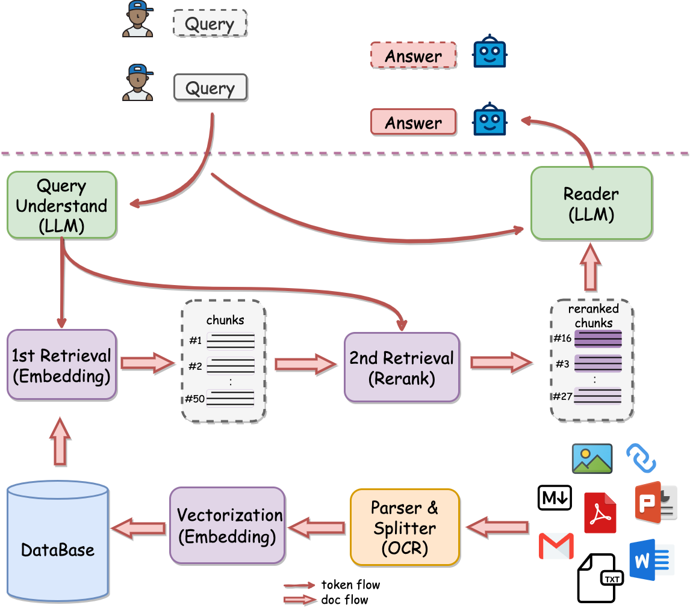

  <a href="http://192.168.5.145:8777/qanything/">
    <!-- Please provide path to your logo here -->
    
  </a>

# **Q**uestion and **A**nswer based on **Anything**

# 什么是QAnything？
**QAnything** (**Q**uestion and **A**nswer based on **Anything**) 是致力于支持任意格式文件或数据库的本地知识库问答系统，可断网安装使用。

当前项目基于开源[Qanything-v2.1](https://github.com/netease-youdao/QAnything)版本继续研发，支持文件类型多，解析成功率高，具体部分情请查看[更新日志](docs/更新日志.md)。

您的任何格式的本地文件都可以往里扔，即可获得准确、快速、靠谱的问答体验。

目前已支持格式: **PDF(pdf)**，**Word(docx)**，**PPT(pptx)**，**XLS(xlsx)**，**Markdown(md)**，**电子邮件(eml)**，**TXT(txt)**，**图片(jpg，jpeg，png)**，**CSV(csv)**，**网页链接(html)**，更多格式，敬请期待...

## 特点
- 数据安全，支持全程拔网线安装使用。
- 支持文件类型多，解析成功率高，支持跨语种问答，中英文问答随意切换，无所谓文件是什么语种。
- 支持海量数据问答，两阶段向量排序，解决了大规模数据检索退化的问题，数据越多，效果越好，不限制上传文件数量，检索速度快。
- 硬件友好，默认在纯CPU环境下运行，且win，mac，linux多端支持，除docker外无依赖项。
- 易用性，无需繁琐的配置，一键安装部署，开箱即用，各依赖组件（pdf解析，ocr，embed，rerank等）完全独立，支持自由替换。
- 支持类似Kimi的快速开始模式，无文件聊天模式，仅检索模式，自定义Bot模式。
- 支持自定义向量模型，支持自定义向量检索模型，支持自定义向量检索服务。

## 架构

### 为什么是两阶段检索?
知识库数据量大的场景下两阶段优势非常明显，如果只用一阶段embedding检索，随着数据量增大会出现检索退化的问题，如下图中绿线所示，二阶段rerank重排后能实现准确率稳定增长，即**数据越多，效果越好**。

## 安装
### 必要条件
| **系统**    | **依赖**                  | **要求**            | **说明**                                                                                 |
|-----------|-------------------------|-------------------|----------------------------------------------------------------------------------------|
|           | RAM Memory              | >= 20GB           |                                                                                        |
| Linux/Mac | Docker version          | >= 20.10.5        | [Docker install](https://docs.docker.com/engine/install/)                              |
| Linux/Mac | docker compose  version | >= 2.23.3         | [docker compose install](https://docs.docker.com/compose/install/)                     |
| Windows   | Docker Desktop          | >= 4.26.1（131620） | [Docker Desktop for Windows](https://docs.docker.com/desktop/install/windows-install/) |

### step1: 安装教程
- 具体部署方法请参考[文档](https://pcnji8zc9hj3.feishu.cn/wiki/Ahh3wL0wIimnEIkAiuicXSUpnxd?from=from_copylink)

### step3: 开始体验

#### 前端页面
运行成功后，即可在浏览器输入以下地址进行体验。

- 前端地址: http://localhost:8777/qanything/

### API
如果想要访问API接口，请参考下面的地址:
- API address: http://localhost:8777/api/
- For detailed API documentation, please refer to [API 文档](docs/api使用说明.md)

### DEBUG
##### 如果想要查看服务启动相关日志，请查看`logs/debug_logs`目录下的日志文件。
- **debug.log**
  - 用户请求处理日志
- **main_server.log**
  - 后端服务运行日志
- **rerank_server.log**
  - rerank服务运行日志
- **ocr_server.log**
  - OCR服务运行日志
- **embedding_server.log**
  - 向量化服务运行日志
- **rerank_server.log**
  - 检索增强服务运行日志
- **insert_files_server.log**
  - 文件上传服务运行日志
- **pdf_parser_server.log**
  - pdf解析服务运行日志
##### 详细上传文件日志请查看`logs/insert_logs`目录下的日志文件。
##### 详细问答日志请查看`logs/qa_logs`目录下的日志文件。
##### 详细embedding日志请查看`logs/embed_logs`目录下的日志文件。
##### 详细rerank日志请查看`logs/rerank_logs`目录下的日志文件。

